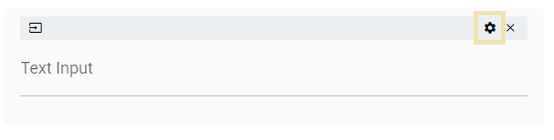
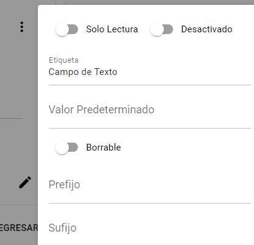

Para ver la configuración del control del formulario mientras pasa el cursor del ratón sobre el control, haga clic en el botón de engranaje en la esquina derecha.

Esto abrirá un panel de diálogo en la esquina derecha de la pantalla con las configuraciones disponibles para el control seleccionado.

Para cerrar el panel, simplemente haga clic fuera de él.