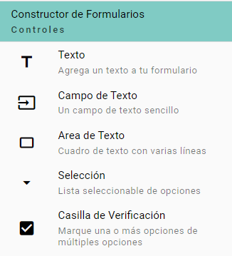
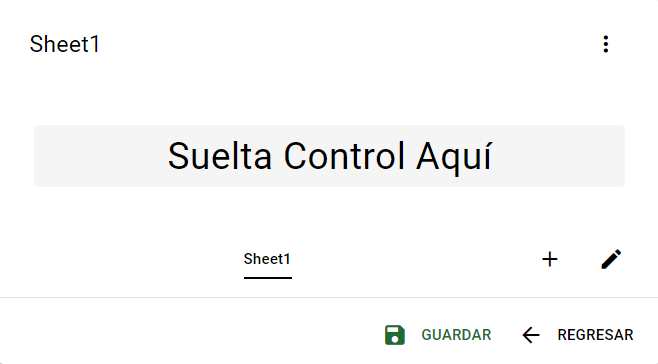
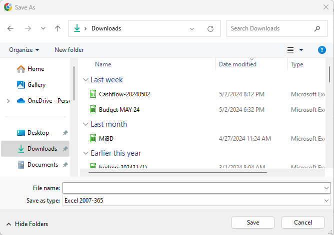
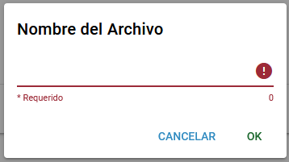

1. Haz lo siguiente:

    - En DnD Forms seleccione **NUEVO** en la barra de herramientas superior.

    

    Esto abrirá la herramienta Creador de Formularios para que pueda comenzar a crear su nuevo formulario.

2. En el menú de la izquierda tienes los **Controles del Creador de Formularios**. Úselos para personalizar cómo y qué tipo de información desea ingresar en su nuevo formulario.

    - Seleccione un control de la lista.

    

3. A continuación, debe colocar el control seleccionado anteriormente en la hoja. Dado que este es el primer control que agrega, solo hay un lugar para eliminar el control.

    - Haga clic izquierdo en el mensaje **Soltar Control Aquí**.

    

    Si seleccionó un control en el paso anterior, debería verlo aparecer en la hoja.
    Puede cambiar el nombre de la hoja seleccionando el botón de edición (lápiz) o agregar una nueva hoja con el signo más (+).

    ::: info
    Repita los pasos 2 y 3 para cada control que desee agregar
    :::

4. Cuando haya terminado de agregar controles y configurar cada control, haga clic en el botón **GUARDAR**. Es posible que vea aparecer la ventana Guardar si el navegador que está utilizando tiene acceso al sistema de archivos; de lo contrario, verá aparecer un pequeño cuadro de diálogo solicitando un nombre de archivo.

    - Con acceso al sistema de archivos, seleccione la ubicación e ingrese un nombre de archivo.

    

    - Sin acceso al sistema de archivos, ingrese un nombre de archivo y luego verifique su carpeta **Descargas**.

    

    **Nota:** DnD Forms utiliza la extensión de archivo **.xlsx** para almacenar archivos.