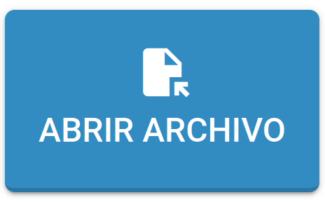

Si ya creó un formulario, puede abrir el archivo de la siguiente manera:

- Pulsando en el botón **ABRIR** del menú superior.

Si su navegador admite el acceso al sistema de archivos, aparecerá la ventana **Abrir Archivo**; de lo contrario, se abrirá un cuadro de diálogo solicitando la carga de un archivo.

- Con acceso al sistema de archivos disponible.

- Sin acceso al sistema de archivos disponible.

