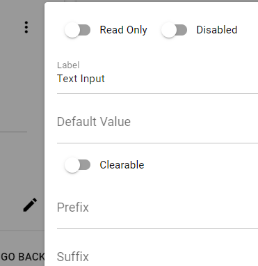

To view form control settings while hovering the mouse cursor on the control click on the gear button on the right corner.

This will open a dialog pane on the right coner of the screen with the available settings for the selected control.

To close the pane simply click outside of it.