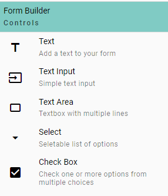
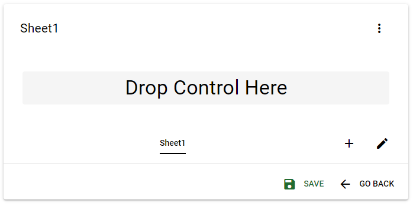
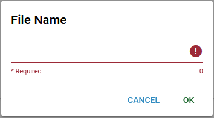

1. Do the following:

    - In DnD Forms home page select **NEW FORM** button.

    

    This will open the Form Builder tool so you can start creating your new form.

2. On the left menu you have your **Form Builder Controls**. Use these to customize how and what type of information you wish to input in your new form.

    - Select one control from the list.

    

3. Next you need to drop the previous selected control on the sheet. Since this is the first control you are adding there is only one spot to drop the control.

    - Left click on the **Drop Control Here** message.

    

    If you selected a control on the previous step then you should see it appear on the sheet.
    You can change the sheet name by selecting the edit button (pencil) or add a new sheet with the plus sign (+).

    ::: info
    Repeat steps 2 and 3 for each control you wish add
    :::

4. When you are done adding controls and configuring each control click on the **SAVE** button. You may see the Save As window appear if the browser you are using has file system access if not you will see a small dialog appear requesting a file name.

    - With file system access select the location and input a file name.

    

    - Without file system access input a file name then check your **Downloads** folder.

    

    **Note:** DnD Forms uses the **.xlsx** file extension to store files.